Quick Quality Control
================
Chris Ulpinnis & Pascal Püllmann
2018-10-11

# Quick Quality Control

You can find the lastest version of this file at
<https://github.com/ipb-halle/GoldenMutagenesis/blob/master/vignettes/QQC.md>

## Experimental Workflow

### Target sequence

open reading frame YfeX in pCA24N (Chloramphenicol resistance)

### Clone into

seperate gene fragments into pAGM9121 first then reassemble into
pAGM22082\_cRed

### Genomic sequence YfeX

ATGTCTCAGGTTCAGAGTGGCATTTTGCCAGAACATTGCCGCGCGGCGATTTGGATCGAAGCCAACGTGAAAGGGGAAGTTGACGCCCTGCGTGCGGCCAGTAAAACATTTGCCGACAAACTGGCAACTTTTGAAGCGAAATTCCCGGACGCGCATCTTGGTGCGGTGGTTGCCTTTGGTAACAACACCTGGCGCGCTCTGAGCGGCGGCGTTGGGGCAGAAGAGCTGAAAGATTTTCCGGGCTACGGTAAAGGCCTTGCGCCGACGACCCAGTTCGATGTGTTGATCCACATTCTTTCTCTGCGTCACGACGTAAACTTCTCTGTCGCCCAGGCGGCGATGGAAGCCTTTGGTGACTGCATTGAAGTGAAAGAAGAGATCCACGGCTTCCGTTGGGTTGAAGAGCGT**GAC**CTGAGCGGCTTTGTT**GAC**GGTACGGAA**AAC**CCGGCGGGTGAAGAGACGCGTCGCGAAGTGGCGGTTATCAAAGACGGCGTGGATGCGGGCGGCAGCTATGTGTTTGTCCAGCGTTGGGAACACAACCTGAAGCAGCTCAACCGGATGAGCGTTCACGATCAGGAGATGGTGATCGGGCGCACCAAAGAGGCCAACGAAGAGATCGACGGCGACGAACGTCCGGAAACCTCTCACCTCACCCGCGTTGATCTGAAAGAAGATGGCAAAGGGCTGAAGATTGTT**CGC**CAG**AGC**CTGCCGTACGGCACTGCCAGTGGCACTCACGGTCTGTACTTCTGCGCCTACTGCGCGCGTCTGCATAACATTGAGCAGCAACTGCTGAGCATGTTTGGCGATACCGATGGTAAGCGTGATGCGATGTTGCGTTTCACCAAACCGGTAACCGGCGGCTATTATTTCGCACCGTCGCTGGACAAGTTGATGGCGCTGTAA

### Restriction Enzyme

#### Level 0

BbsI

Recognition site: ***GAAGAC***

#### Level 2

BsaI

Recognition site: ***GGTCTC***

### Envisioned Mutations

Aspartic Acid - 137  
Aspartic Acid - 143  
Asparagine - 147  
Arginine - 232  
Serine - 234  
  
Substitute for NDT

## R Workflow

### Sequence and Mutations

The target sequence and the envisioned mutations are used as input
again.

``` r
suppressWarnings(suppressMessages(library("GoldenMutagenesis")))
```

``` r
input_sequence<-"ATGTCTCAGGTTCAGAGTGGCATTTTGCCAGAACATTGCCGCGCGGCGATTTGGATCGAAGCCAACGTGAAAGGGGAAGTTGACGCCCTGCGTGCGGCCAGTAAAACATTTGCCGACAAACTGGCAACTTTTGAAGCGAAATTCCCGGACGCGCATCTTGGTGCGGTGGTTGCCTTTGGTAACAACACCTGGCGCGCTCTGAGCGGCGGCGTTGGGGCAGAAGAGCTGAAAGATTTTCCGGGCTACGGTAAAGGCCTTGCGCCGACGACCCAGTTCGATGTGTTGATCCACATTCTTTCTCTGCGTCACGACGTAAACTTCTCTGTCGCCCAGGCGGCGATGGAAGCCTTTGGTGACTGCATTGAAGTGAAAGAAGAGATCCACGGCTTCCGTTGGGTTGAAGAGCGTGACCTGAGCGGCTTTGTTGACGGTACGGAAAACCCGGCGGGTGAAGAGACGCGTCGCGAAGTGGCGGTTATCAAAGACGGCGTGGATGCGGGCGGCAGCTATGTGTTTGTCCAGCGTTGGGAACACAACCTGAAGCAGCTCAACCGGATGAGCGTTCACGATCAGGAGATGGTGATCGGGCGCACCAAAGAGGCCAACGAAGAGATCGACGGCGACGAACGTCCGGAAACCTCTCACCTCACCCGCGTTGATCTGAAAGAAGATGGCAAAGGGCTGAAGATTGTTCGCCAGAGCCTGCCGTACGGCACTGCCAGTGGCACTCACGGTCTGTACTTCTGCGCCTACTGCGCGCGTCTGCATAACATTGAGCAGCAACTGCTGAGCATGTTTGGCGATACCGATGGTAAGCGTGATGCGATGTTGCGTTTCACCAAACCGGTAACCGGCGGCTATTATTTCGCACCGTCGCTGGACAAGTTGATGGCGCTGTAA"

mutations<-c(137,143,147,232,234)
```

### Quality Control

The functions aligns the obtained sequencing results to the target gene
sequence. It also tries to align the reverse complement of the obtained
sequence. Afterwards it checks for mismatches between the sequences.
Mismatches are likely to be sucessfully mutated nucleotides. Positions
regarded as mismatches are displayed as pie charts. The shown
distributions are based on the signal intensities of the four
nucleobases at the mismatch positions. You can compare the pie charts
with expected pattern of randomization, therefore validating the quality
of the created library.

#### Forward Sequencing

``` r
abfile<-"sequences/Yfex_0activesite_for_EF01147142.ab1")
base_distribution(input_sequence=input_sequence, ab1file=abfile, replacements=mutations)
```

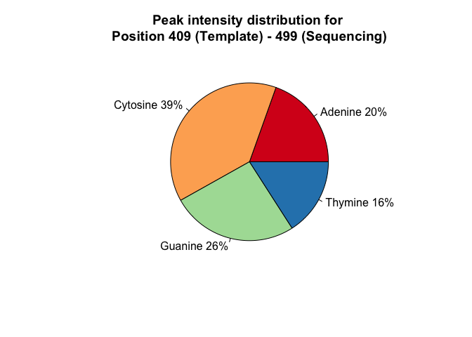<!-- -->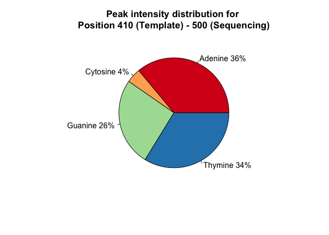<!-- --><!-- --><!-- --><!-- -->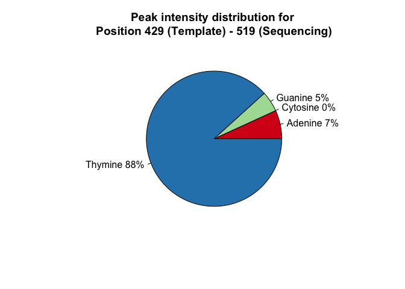<!-- -->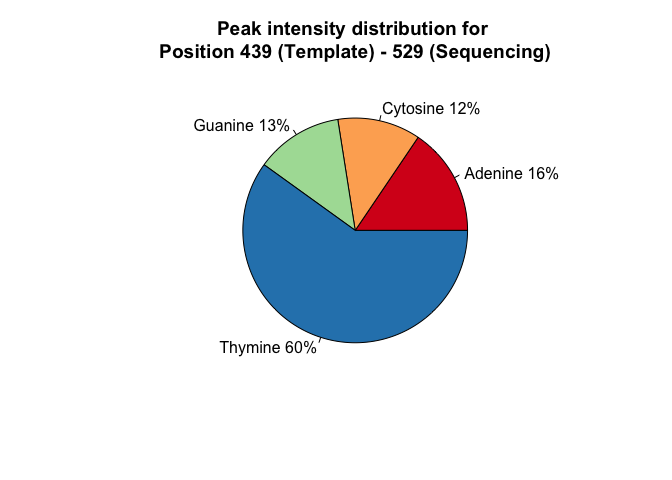<!-- -->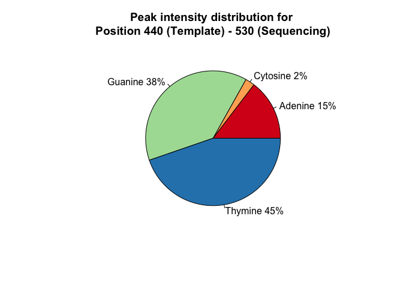<!-- -->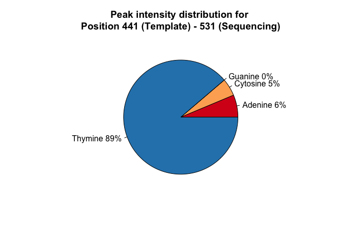<!-- -->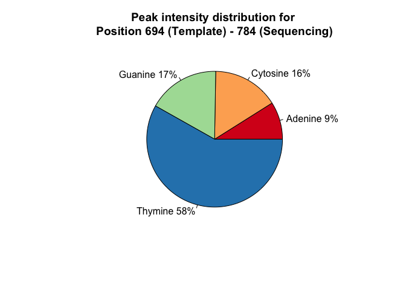<!-- -->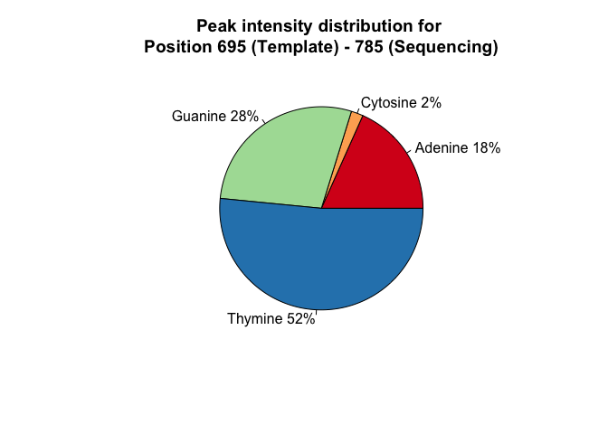<!-- -->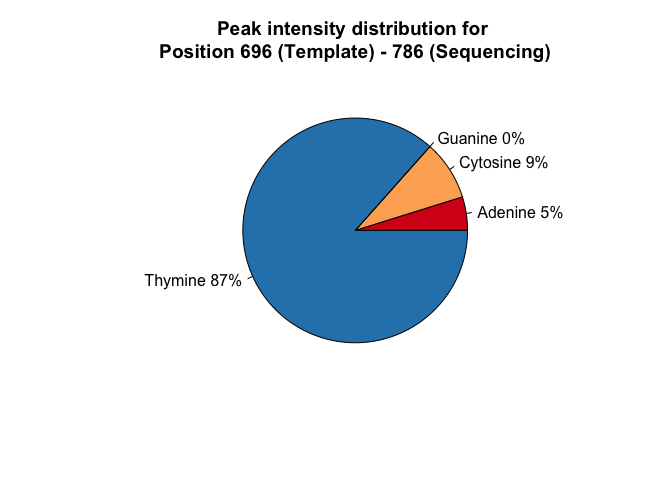<!-- --><!-- --><!-- --><!-- -->

#### Reverse Sequencing

``` r
abfile<-"sequences/Yfex_activesite_rev_EF01147143.ab1")
base_distribution(input_sequence=input_sequence, ab1file=abfile, replacements=mutations)
```

    ## [1] "Reverse sequence detected!"

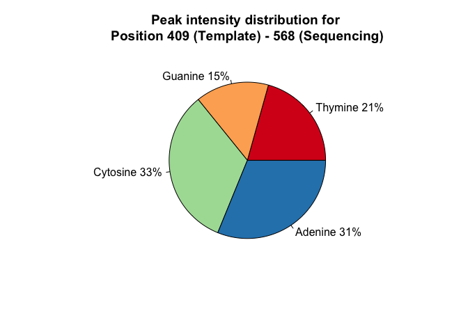<!-- -->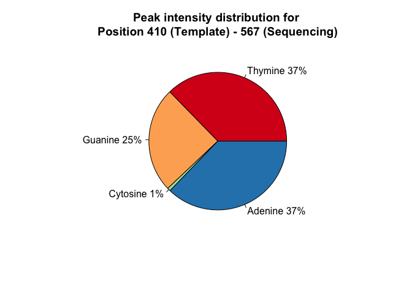<!-- -->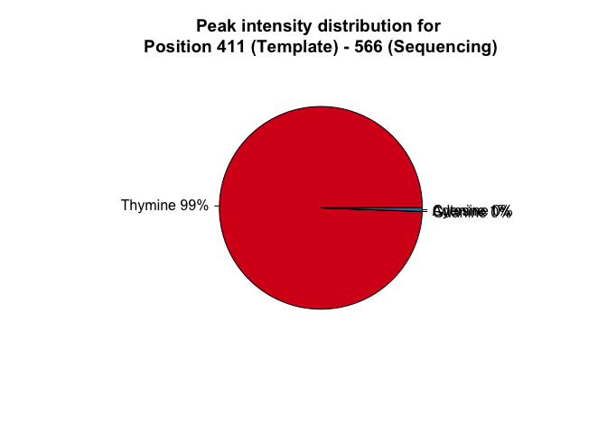<!-- --><!-- -->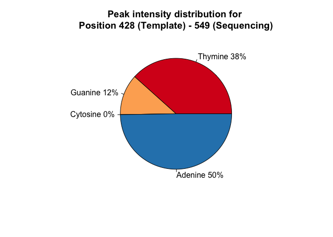<!-- --><!-- -->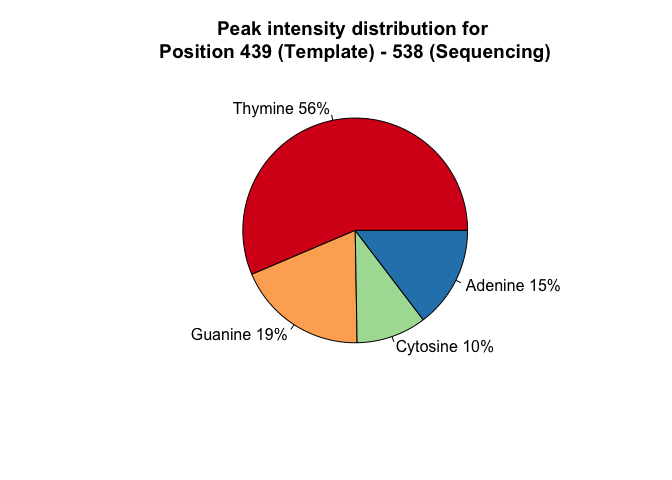<!-- --><!-- --><!-- --><!-- -->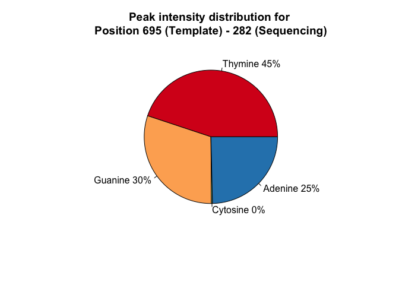<!-- --><!-- --><!-- --><!-- -->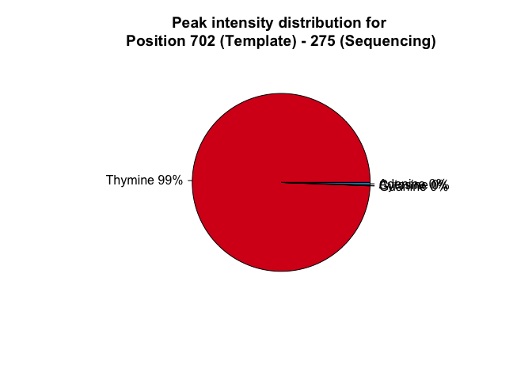<!-- -->
